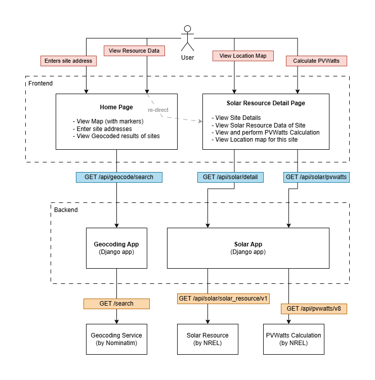

# Solar Resource Explorer

A Django-based web application that ingests site addresses from a map and loads its solar resource data with PVWatts calcuation. It integrates NREL APIs to provide solar irradiance data and PVWatts calculations and Nominatim to provide geocoding service.

Solar Resource Explorer allows users to:
- Input at least 5 site addresses and view its locations on a map using geocoding.
- View solar resource data at monthly and annually average.
- Calculate PVWatts for a customized system configuration at the selected location.
- Visualize site locations on an interactive map

## Features

### Geocoding
- Text address to coordinates conversion
- Real-time location validation and lookup
- Data via OpenStreetMap Nominatim API

### Solar Resource Data
- Direct Normal Irradiance (DNI)
- Global Horizontal Irradiance (GHI)
- Tilted-surface Irradiance
- Monthly and annual averages
- Data via NREL Solar Resource API

### PVWatts Calculator
- System information configuration
- Monthly AC Power Output, DC Power Output, POA Irradiance and Solar Radiance
- Station Indentification and Information
- Performance Metrics

### Map Integration
- Interactive Leaflet maps with location markers
- Quick link to Google Maps
- Real-time coordinate display

### API Documentation
- Auto-generated Swagger UI
- OpenAPI schema for easy integration built with DRF Spectacular

## Architecture


### Overview
The above diagram shows the high-level architecture with all functional components illustrated.

- **Frontend Layer:** Using Django templates, vanilla JS and Swagger UI (for backend API documentation)
- **API Layer:** Django REST framework
- **Service Layer:** Django apps with stateless functionality. Data loaded from external APIs
- **External Dependencies:** Nominatim (for geocoding). NREL (for solar data and PVWatts calculation)

### Key Tradeoffs
1. No Database models: Uses immutable @dataclass Python objects. Data is always user-configurable so no need to store. This will be problem for history tracking, filtering or application monitoring (how many users, how many lookups, etc.)

2. External API calls are abstracted: To decouple application and external API layers. This makes the application APIs customizable. But since there's not much change in API usage logic, this may look unecessary. However, as application grows and more custom the solution becomes, this abstraction becomes warranted. 

3. Stateless Design: No session or caching. Easy to deploy. But the problem comes when user queries the same request, the entire workflow is trigged end-to-end. Not ideal for scalability.

4. External API dependency: All resource data and calculation are being loaded from external APIs.

5. Duplicate address handling: This is tricky to handle as "College Avenue Student Center" or "College Avenue Student Center, Rutgers" or "97 Hamilton St, New Brunswick, NJ 08901" all resolves to same approximate geocode location. However their names are different. This part has been skipped in the current implementation.


### Handling Invalid Addresses
This is implemented by leveraging the external geocoding service. The external API gives an empty body response when an address cannot be resolved (invalid or non-existent). The application backend checks if response is empty and returns an error message to the user on the screen. The application proceeds to geocode all other valid addresses but blocks geocoding of the invalid address.


## Tech Stack

- **Backend:** Django 4.x, Django REST Framework
- **Frontend:** HTML5, CSS, JavaScript (Vanilla)
- **Maps:** Leaflet.js, Openstreetmap
- **External APIs:** NREL, Nominatim

## Installation

### Prerequisites
- Python 3.8+
- pip
- virtualenv (recommended)

### Development Setup (local)

1. Clone the repository
   ```bash
   git clone <repository-url>
   cd solar-resource-explorer
   ```

2. Create and activate virtual environment
    ```bash
    python -m venv .venv

    # On Windows
    .\.venv\Scripts\activate

    # On macOS/Linux
    source .venv/bin/activate
    ```

3. Install dependencies
    ```bash
    pip install -r requirements.txt
    ```

4. Create a new .env file in project root
    ```bash
    cp .env.example .env
    ```

    Update API Keys in .env file
    ```bash
    SECRET_KEY="your-secret-key"
    NREL_API_KEY="your_nrel_api_key_here"
    ```

5. Run migrations (from project root directory)
    ```bash
    python manage.py migrate
    ```

6. Start development server (from project root directory)
    ```bash
    python manage.py runserver
    ```
    Both server and UI will be accessible from http://127.0.0.1:8000/


## Project Structure
```
solar-resource-explorer/
├── apps/
│   ├── geocoding/          # Geocoding app
│   │   ├── views.py        
│   │   ├── services.py    
│   │   ├── serializers.py
│   │   └── urls.py        
│   └── solar/              # Solar resource & PVWatts
│       ├── views.py        
│       ├── services.py     
│       ├── serializers.py 
│       └── urls.py         
├── main/                   # Main app (landing page)
│   ├── views.py
│   ├── urls.py
│   └── templates/
│       └── main/
│           ├── home.html
│           └── solar_resource_detail.html
├── config/                # App Configuration
│   └── config.py          # External API endpoints & keys
├── solar_resource_explorer/
│   ├── settings.py        # Django settings
│   ├── urls.py            # Root URL routing
│   ├── wsgi.py            
│   └── asgi.py            
├── static/                
├── templates/             
├── manage.py              
├── db.sqlite3             # SQLite database (not used here)
├── requirements.txt       # Dependencies
└── README.md             
```